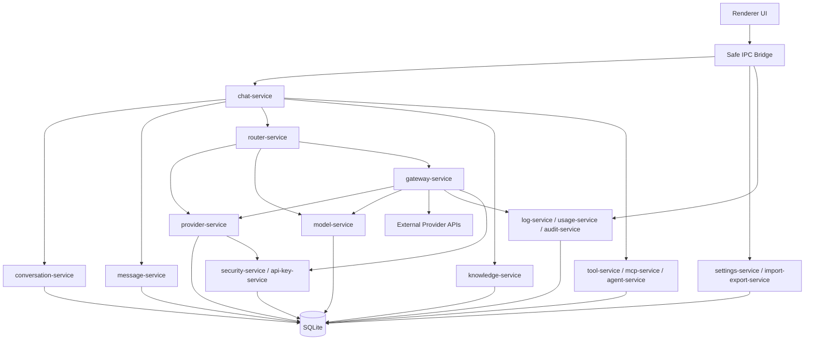

# Module Relationships

## Overview

NexaChat uses a local-first layered architecture. UI calls typed IPC clients. Provider adapters own protocol differences, and the local Gateway is an independent core module.

Current source fact: `src/main/services/store.ts` still owns the aggregate `NexaStore` service for most business logic, SQLite access, security checks, audit writes, and snapshot assembly. The service names in this diagram are extraction targets and boundaries for future refactors, not proof that those standalone services are already fully split.

## Chat To Model Router

Chat receives user input, selected assistant, selected context strategy, and optional selected model. If a specific model is locked, Chat still asks Router to validate availability. If no model is locked, Router chooses based on route rules.

## Model Router To Provider / Model

Router evaluates:

- explicit user choice
- workspace default
- assistant default
- task type
- price
- speed
- context length
- health
- fallback rules

Router returns a route decision with `provider_id`, `model_id`, `model_name_snapshot`, route reason, and fallback metadata.

## Provider To Real API Request

Provider stores connection configuration. Gateway resolves Provider through `provider-service`, fetches secrets through `security-service`, and calls a Provider adapter for the actual request.

## Request Log Recording

Gateway creates `request_logs` when a request starts, updates status during streaming, and completes with tokens, latency, finish reason, or normalized error. Logs link to conversation, assistant message, provider, model, and route decision.

## Message Local Save

`message-service` writes user messages before generation. It creates assistant messages in `streaming` state, appends deltas, and finalizes completed, failed, or cancelled status. Messages remain in local SQLite regardless of API changes.

## Gateway Reuses Router

Local Gateway accepts external OpenAI-compatible requests. It does not duplicate model selection. It maps incoming model names or virtual models to Router decisions and uses the same Gateway runtime as Chat.

## Knowledge In Chat

Knowledge service retrieves chunks, citations, temporary context, and memories based on the selected context strategy. Chat includes retrieved context in the request and links citations to messages.

## MCP / Tool / Agent In Chat

Tool, MCP, and Agent modules provide optional capabilities. Chat can call approved tools, discover approved MCP tools, or start Agent runs. Tool calls create logs and traces and require permissions.

## Config Effects

Config affects Provider, Model, Router, Gateway, UI preferences, workspace defaults, import/export, and security policy. Config changes create audit logs when security-relevant.

## Security For API Keys

Security service stores API keys and gateway keys with Electron safeStorage / system Keychain strategy. Renderer never reads raw secrets. Logs and exports use redaction.

## UI Through IPC

Renderer cannot read SQLite or secrets directly. It calls typed IPC methods exposed by preload. Main process validates inputs, applies permission/security policy, and returns safe DTOs.
